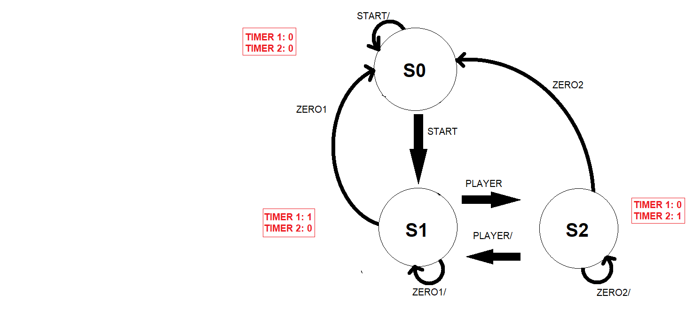

# CHESS CLOCK
## Overview
This project is a behavioural-level design for a chess clock using Verilog. It was designed using 'Vivado 2020.2'.
This project consists of 2 counters that act as clocks, control flow registers, D-flip flops for debouncing keys, and testbench code for thorough testing.
## FOR THE FUTURE:
• I will be updating this repository soon with a RTL design and a physical implementation.

**State Diagram**

**Schematic**

**Result of simulation for sample testbench provided**

