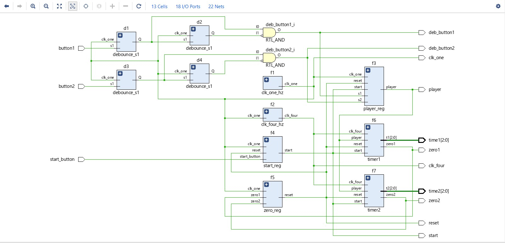
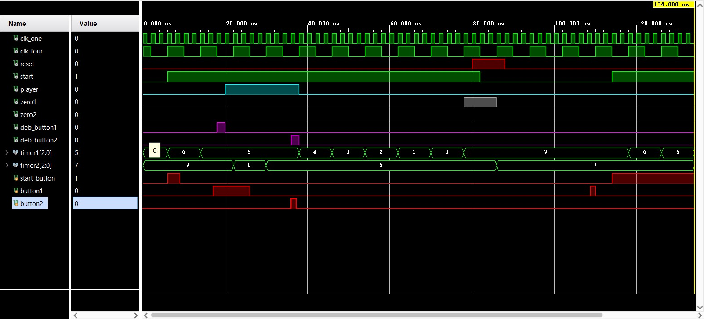

# CHESS CLOCK
## Overview
This is a behavioral level design for a chess clock. It was designed using 'Vivado 2020.2'
## FOR THE FUTURE:
• I will be updating this repository soon with a RTL design and a physical implementation.

**Schematic**

**Result of simulation for sample testbench provided**

